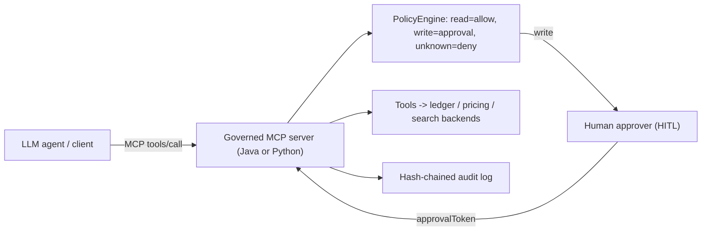

# governed-mcp-gateway

[](./.github/workflows/ci.yml)

> Governed **Model Context Protocol (MCP)** servers in **both Java and Python**, exposing enterprise
> tools (ledger, pricing, search) to an LLM agent behind a governance layer: read/write sensitivity
> classification, **human-in-the-loop approval** for write actions, role-based policy, and a
> hash-chained **audit log**. The connective tissue that lets agents act on systems of record safely.

Part of the [Enterprise Platform Reference Architecture](../README.md). Models the platform
engineering / agentic enablement domain. See [`docs/INDUSTRY-APPLICABILITY.md`](docs/INDUSTRY-APPLICABILITY.md).

## Why two languages?
Enterprises are polyglot. The same governance model is implemented identically in
[`python-mcp-server`](python-mcp-server) (JSON-RPC over stdio) and
[`java-mcp-server`](java-mcp-server) (JSON-RPC over HTTP), proving the pattern is transport- and
language-agnostic.

## Architecture



## Governance model (identical in both)
| Tool class | Example | Policy |
|---|---|---|
| READ | `get_account_balance`, `search_docs`, `lookup_supplier`, `lookup_location`, `lookup_item_cost` | Allowed for any known role |
| WRITE | `post_payment`, `propose_price_change` | Requires human approval (unless trusted role) |
| Unknown role | — | Denied |

Every call -- allowed, denied, or pending approval -- is appended to a hash-chained audit log;
`verify()` detects any tampering with history.

## Run

### Python (stdio MCP)
```bash
cd python-mcp-server
python -m venv .venv && source .venv/bin/activate && pip install pytest
pytest -q
python -m agent_mcp.server   # speak JSON-RPC on stdin/stdout
```

### Java (HTTP MCP)
```bash
cd java-mcp-server
mvn spring-boot:run          # POST JSON-RPC to http://localhost:8086/mcp ; GET /audit
mvn test
```

### Both via Docker
```bash
docker compose up --build
```

## Retail merchandising copilot slice

Three **READ** tools wire the gateway to the retail pillar repos (mocked offline, HTTP in production):

| MCP tool | Retail repo | API shape |
|---|---|---|
| `lookup_supplier` | [supplier-golden-record-platform](https://github.com/mizbamd/supplier-golden-record-platform) | `GET /api/suppliers/legacy/{id}` |
| `lookup_location` | [location-reference-cache](https://github.com/mizbamd/location-reference-cache) | `GET /api/locations/{nbr}` |
| `lookup_item_cost` | [item-cost-ledger-platform](https://github.com/mizbamd/item-cost-ledger-platform) | `GET /api/costs/clubs/{club}/items/{item}` |

```bash
cd python-mcp-server && PYTHONPATH=src python -m agent_mcp.merchandising_demo
```

See [`docs/RETAIL-MERCHANDISING-MCP.md`](docs/RETAIL-MERCHANDISING-MCP.md).

## Documentation
- [System design](docs/SYSTEM-DESIGN.md)
- [Industry applicability](docs/INDUSTRY-APPLICABILITY.md)
- Business & governance: [BRD](docs/BRD.md) - [SOP](docs/SOP.md) - [NFR](docs/NFR.md) - [Cost savings](docs/COST-SAVINGS.md)
- ADRs: [`docs/adr/`](docs/adr/)

## Tech
Python 3.11+ (stdlib-only server core), Java 21 + Spring Boot 3.3, MCP JSON-RPC 2.0.
